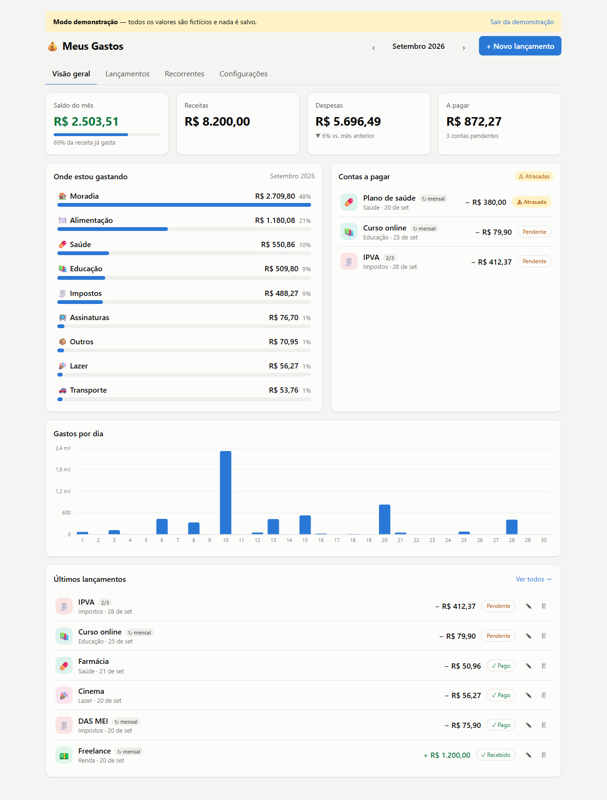
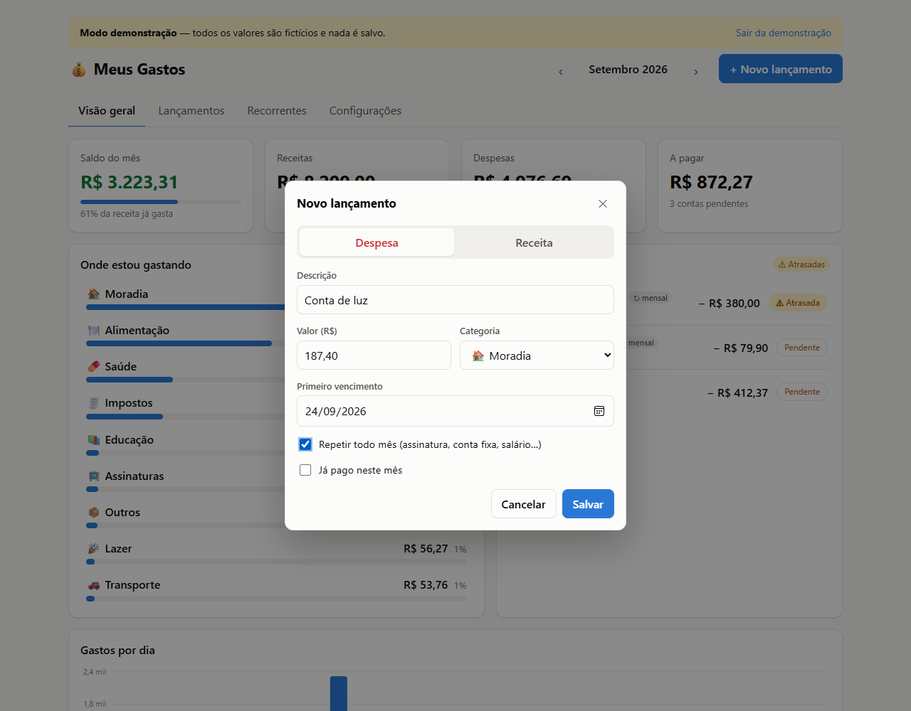
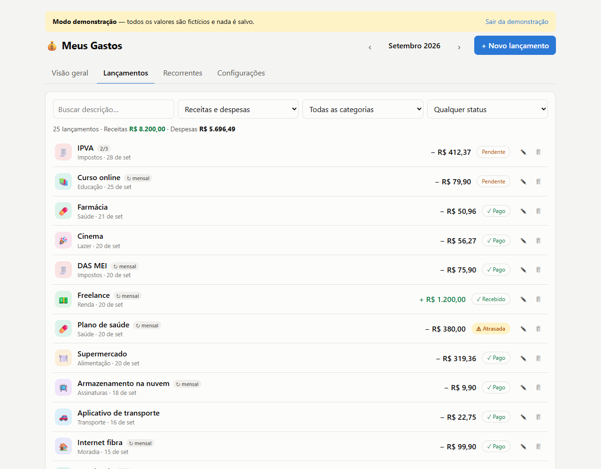
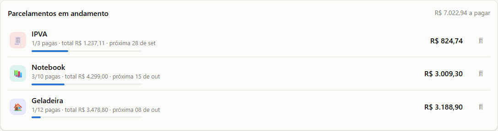
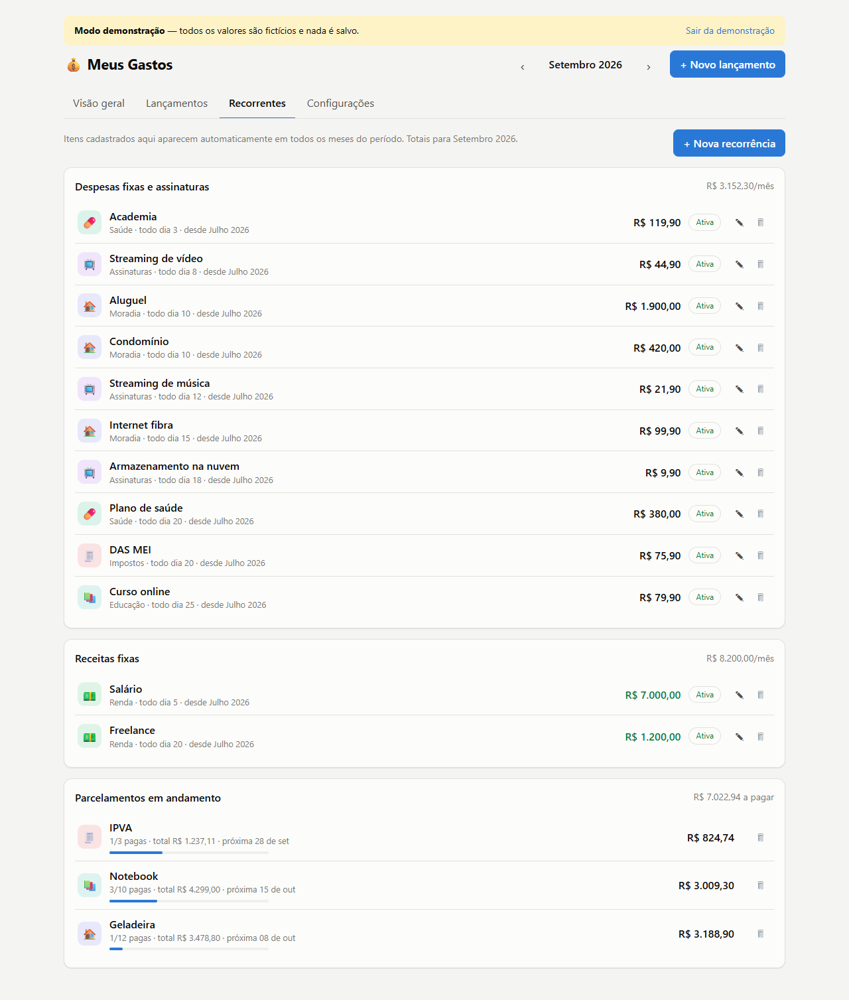
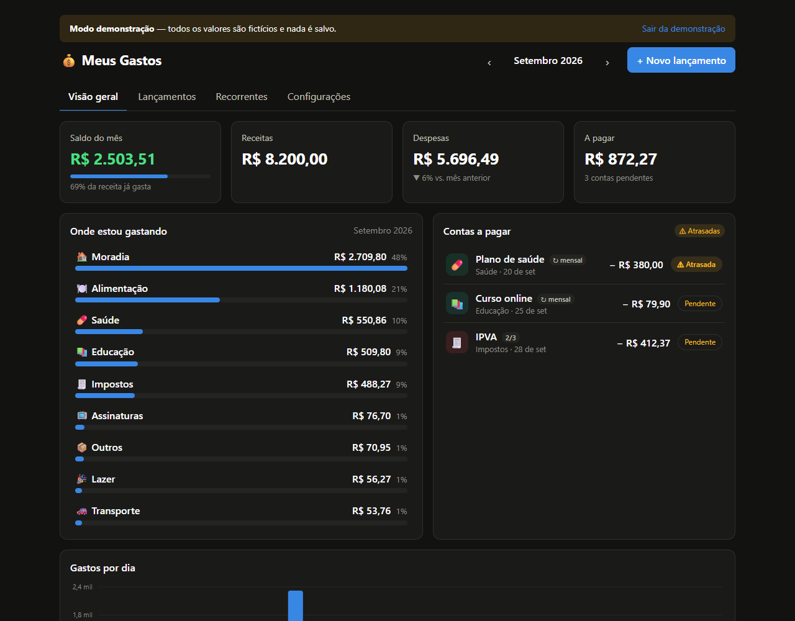
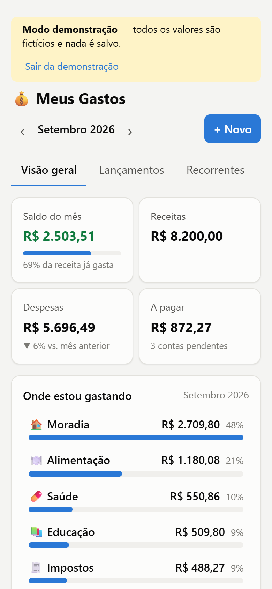

# 💰 Meus Gastos — dashboard de finanças pessoais

Aplicação web para acompanhar as finanças do mês: saldo, gastos por categoria, assinaturas e contas fixas, impostos e contas a pagar, com sincronização entre dispositivos e login com Google.


**▶ [Ver demonstração](https://SEU-APP.vercel.app/?demo)**: abre o app completo com **dados fictícios**, sem login e sem salvar nada.



> Todos os valores mostrados neste README e na demonstração são fictícios.

## Funcionalidades

- **Saldo do mês** (receitas − despesas), com o percentual da receita já gasto e comparação com o mês anterior.
- **Onde estou gastando**: ranking de categorias com valor e percentual. Clicar numa categoria abre os lançamentos filtrados.
- **Contas a pagar**: pendências do mês, com as atrasadas destacadas.
- **Lançamentos recorrentes**: salário, aluguel e assinaturas são cadastrados uma vez e aparecem todo mês, cada mês com seu próprio status de pago. Aceita valor diferente em um mês específico (ex.: conta de luz), pausa e data de término.
- **Compras parceladas**: informe o valor total ou o da parcela, o número de parcelas e a data da 1ª. Cada parcela cai no mês certo (com etiqueta "3/10") e os centavos da divisão ficam na última. Um painel mostra os parcelamentos em andamento e quanto falta pagar.
- **Lançamentos**: busca e filtros por tipo, categoria e status; marcar como pago, editar e excluir.
- **Categorias personalizáveis** (nome, emoji, cor) e **backup/importação em JSON**.
- **Tema claro/escuro** automático, **responsivo** e **funciona offline**.

### Compras parceladas

| Lançar uma compra parcelada | Parcelas no mês (etiqueta "2/3") |
|---|---|
|  |  |



### Outras telas

| Recorrentes | Tema escuro | Celular |
|---|---|---|
|  |  |  |

## Stack

| Camada | Tecnologia |
|---|---|
| Interface | React 19, TypeScript, CSS puro com variáveis (tema claro/escuro) |
| Build | Vite 8 (Rolldown), com code-splitting de Firebase e gráficos |
| Gráficos | Recharts |
| Datas e moeda | date-fns (pt-BR), `Intl.NumberFormat` (BRL) |
| Backend | Firebase Authentication (Google), Cloud Firestore |
| Hospedagem | Vercel (deploy automático a cada push) |
| Testes | Playwright ponta a ponta contra os Firebase Emulators |

## Decisões técnicas

- **Recorrências como instâncias virtuais.** Uma assinatura não é copiada para cada mês. `getMonthItems()` (`src/lib/selectors.ts`) gera as ocorrências do mês a partir do cadastro mais um mapa de status por mês (`pago`, `valor só neste mês`, `pulado`). Não há duplicação, editar o cadastro vale para os meses seguintes, e remover só um mês não afeta os outros.
- **Parcelas como lançamentos reais.** Uma compra em 10x gera 10 transações ligadas por um `groupId` (`src/lib/installments.ts`). Assim, totais, gráficos e contas a pagar funcionam sem código especial, cada parcela tem o próprio status de pago, e dá para excluir "só esta", "esta e as próximas" ou "todas".
- **Store independente do backend.** Os componentes usam só `useFinance()` e `useDispatch(action)`. Existem duas implementações da mesma API (`src/store/FinanceStore.tsx`):
  - **Firestore**: listeners em tempo real e cada ação vira uma gravação (lotes para operações em massa).
  - **Demonstração**: um `useReducer` em memória (`src/store/reducer.ts`) com dados gerados (`src/store/demoData.ts`).
- **Firebase inicializado sob demanda.** A demo não carrega a conexão com o Firebase e não faz nenhuma requisição externa (verificado nos testes).
- **Offline e resposta imediata.** Com o cache persistente do Firestore, as alterações aparecem na hora e sincronizam quando a conexão volta.
- **Modelo de dados por subcoleções** (`users/{uid}/transactions|recurring|categories`), para não esbarrar no limite de 1 MB por documento com o passar dos anos.

## Privacidade e segurança

O código é público, mas os dados financeiros reais não são:

- **Nenhum dado real no repositório.** Screenshots e demonstração usam valores fictícios. Os dados reais ficam apenas no Firestore, e backups exportados são ignorados pelo Git.
- **Acesso restrito por regras** (`firestore.rules`). Só contas presentes numa *allowlist* (`allowed/{uid}`) acessam o app, e cada conta só lê e grava `users/{uid}/…`. A allowlist é criada manualmente no console e o app não consegue gravá-la, então ninguém se autoriza sozinho, mesmo logando com Google.
- **Validação no servidor**: tipos e limites de campos são checados nas regras.
- **Nenhuma configuração no Git**: a config do Firebase fica em `.env.local` e o ID do projeto em `.firebaserc`, ambos ignorados.
- **Testado**: nos emuladores, um segundo usuário tentando ler os dados do dono, ler os próprios dados sem estar na allowlist ou se incluir nela recebe `403`.

## Rodando localmente

Pré-requisito: Node 20+.

```bash
npm install
npm run dev          # abre sem Firebase configurado → botão "Ver demonstração"
```

**Com os emuladores do Firebase** (requer Java; não precisa de projeto real):

```bash
npm run emulators        # Auth + Firestore locais
npm run dev:emulators    # em outro terminal
```

Faça login pela tela do emulador e crie o documento `allowed/<UID>` na interface em http://127.0.0.1:4000.

<details>
<summary><strong>Configurando um projeto Firebase próprio</strong></summary>

1. No [console do Firebase](https://console.firebase.google.com/), crie um projeto, ative **Authentication → Google** e **Firestore** (modo produção), e registre um app **Web**.
2. Copie `.env.example` para `.env.local` e preencha com a config do app Web.
3. Rode `npx firebase login`, `npx firebase use --add` e `npm run deploy:rules` para publicar as regras do Firestore.
4. Rode `npm run dev` e entre com Google. A tela "Conta não autorizada" mostra seu UID: crie o documento `allowed/<UID>` no Firestore e recarregue a página.
5. **Vercel**: importe o repositório, cadastre as variáveis `VITE_FIREBASE_*` em *Environment Variables* e faça o deploy.
6. No Firebase, em *Authentication → Settings → Authorized domains*, adicione o domínio `*.vercel.app` do app.

</details>

## Estrutura

```
src/
  App.tsx                  # layout, abas e visão geral
  components/              # telas (Lançamentos, Recorrentes, Configurações), formulário, gráficos
  lib/selectors.ts         # regras de negócio: itens do mês, totais, categorias, recorrências
  lib/firebase.ts          # inicialização do Firebase sob demanda
  store/FinanceStore.tsx   # store: provider Firestore + provider de demonstração
  store/reducer.ts         # reducer em memória (demonstração)
  store/demoData.ts        # gerador de dados fictícios
firestore.rules            # regras de acesso e validação
vercel.json                # rewrite SPA, cache e cabeçalhos de segurança
```
